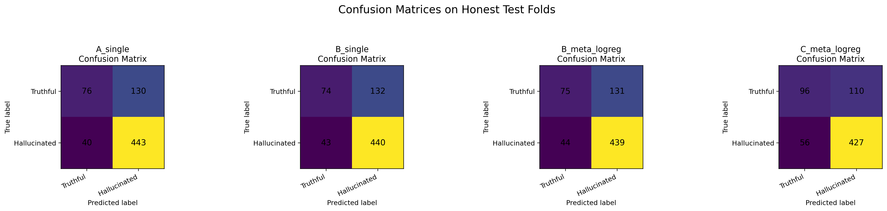
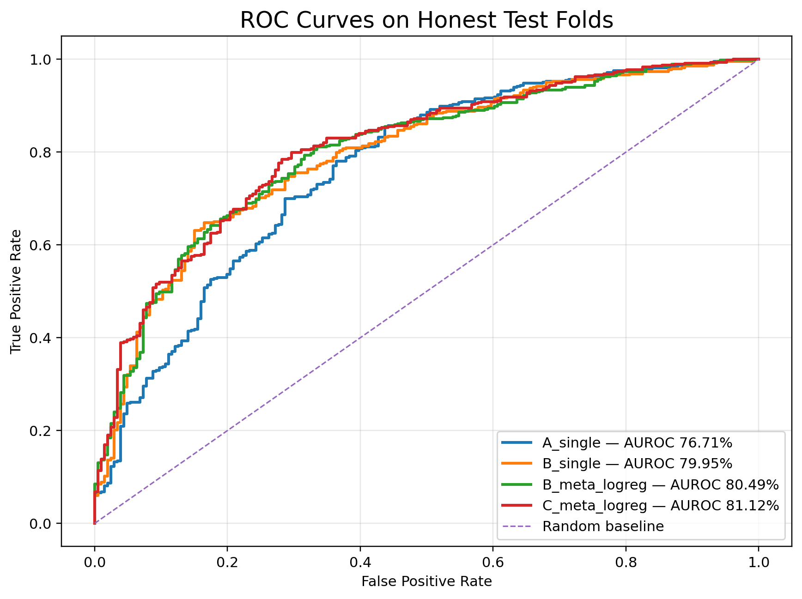
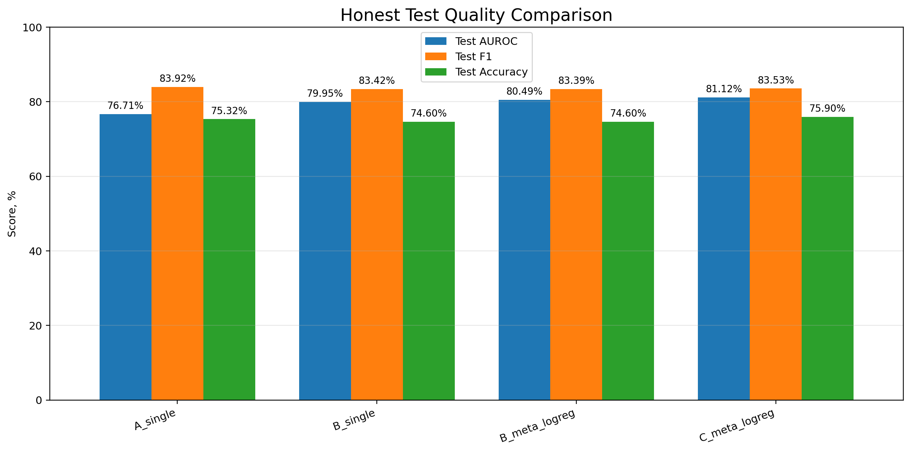

# Hallucination Detection Solution

# Table of contents

- [Repository setup](#repository-setup)
- [Final selected models](#final-selected-models--plots)
- [What do tracks mean](#what-do-tracks-mean)
- [Repository branches](#repository-branches)
- [Modified components](#modified-components)
- [splitting.py modifications](#splittingpy-modifications)
- [Final models quick explanation](#final-models-quick-explanation)
  - [Track A](#track-a)
  - [Track B single model](#track-b-single-model)
  - [Track B meta model](#track-b-meta-model)
  - [Track C](#track-c)
- [Extended Description of Track A](#extended-description-of-track-a)
- [My research path](#my-research-path)
- [Experiments, failed attempts and main findings](#experiments-failed-attempts-and-main-findings)
  - [Heavy tree-based models](#heavy-tree-based-models)
  - [Threshold tuning](#threshold-tuning)
  - [Ensemble experiments](#ensemble-experiments)
  - [Feature-space scaling and dimensionality reduction](#feature-space-scaling-and-dimensionality-reduction)
  - [Hidden-state feature engineering](#hidden-state-feature-engineering)
  - [Prompt-aware infrastructure (Track B)](#prompt-aware-infrastructure-track-b)
  - [Attention-aware infrastructure (Track C)](#attention-aware-infrastructure-track-c)
  - [Main conclusions](#main-conclusions)

## Repository setup

Current `main` branch contains the final honest Track A solution.

### Run instructions

```bash
git clone https://github.com/adtsvetkov/SMILES-2026-Hallucination-Detection
cd SMILES-2026-Hallucination-Detection

python3 -m venv .venv
source .venv/bin/activate

python -m pip install -r requirements.txt

python solution.py
```

The solution uses:
- official evaluation pipeline;
- honest stratified K-Fold evaluation;
- no label leakage;
- no modifications to the official scoring logic.

---

# Final selected models + plots

| Track | Model | Feature Dim | Train Accuracy | Train F1 | Train AUROC | Val Accuracy | Val F1 | Val AUROC | Test Accuracy | Test F1 | Test AUROC |
|---|---|---:|---:|---:|---:|---:|---:|---:|---:|---:|---:|
| Baseline | Majority-class baseline | 896 | 79.20% | 87.39% | 100.00% | 72.53% | 83.41% | 66.01% | 70.83% | 82.39% | 72.08% |
| A | `A__advanced_all__top1250__pca256` | 21644 | 86.71% | 90.96% | 93.17% | 73.49% | 82.19% | 73.27% | **76.78%** | **84.32%** | 76.82% |
| B | `B__prompt_len_features_all__top312__pca32` | 24912 | 78.68% | 85.60% | 84.64% | 74.46% | 82.93% | 75.06% | 76.20% | 83.94% | 79.93% |
| B | `B_prompt_len_prob_meta_logreg` | 41397 | 79.71% | 87.18% | 89.42% | **75.90%** | **85.00%** | **76.23%** | 74.74% | 84.12% | **80.37%** |
| C (experimental) | `C_greedy_step4_4blocks_rank_fusion` | 2432 | --- | --- | --- | --- | --- | --- | 74.46% | 80.75% | 81.37%|

### Best Results

- **Best Test AUROC: (notebook pipeline)** `C_greedy_step4_4blocks_rank_fusion` — **81.37%**
- **Best Test AUROC: (proved)** `B_prompt_len_prob_meta_logreg` — **80.37%**
- **Best Test Accuracy:** `A__advanced_all__top1250__pca256` — **76.78%**
- **Best Validation AUROC:** `B_prompt_len_prob_meta_logreg` — **76.23%**

## What do tracks mean

- Track A is the honest setting: it keeps the original pipeline unchanged and uses only the hidden states that are already available from the official solution flow. No prompt length, attentions, logits, or extra model outputs are used.
- Track B is a less strict setting: we add an extra dataset read inside `aggregation.py` to reconstruct `prompt_len` and build exact prompt/response masks. This gives stronger prompt-aware features, but it is not as clean as Track A because it relies on additional access to the original dataset inside aggregation.
- Track C is the least strict setting: it uses the Track B `prompt_len` reconstruction and additionally modifies model inference to return attentions. This enables attention-grounding and prompt-response attention features, but it moves furthest away from the original official pipeline.

<details>
<summary><strong>Additional Visualizations (Notebook Experiments)</strong></summary>

The following visualizations were generated from notebook-based experiments used during research and model comparison.

These experiments closely follow the official evaluation pipeline, but minor differences may exist due to:
- notebook-side evaluation utilities;
- threshold tuning;
- pooled prediction visualization;
- experimental Track C infrastructure.

Despite these small implementation differences, the overall ranking and relative model behavior remain consistent with the official pipeline results.

---

### Confusion Matrices



---

### ROC Curves



---

### Test Metrics Comparison



</details>

---
# Repository branches

## First iteration

Initial hidden-state baseline experiments:

[`first_iter_12th_may`](https://github.com/adtsvetkov/SMILES-2026-Hallucination-Detection/tree/first_iter_12th_may)

Contains:
- first geometric hidden-state features;
- early linear probes;
- initial honest evaluation experiments.

More details you can find in [`solution.md`](https://github.com/adtsvetkov/SMILES-2026-Hallucination-Detection/blob/first_iter_12th_may/SOLUTION.md) inside this branch.

---

## Track B branch

Track B single + meta solutions:

[`second_iter_track_B`](https://github.com/adtsvetkov/SMILES-2026-Hallucination-Detection/tree/second_iter_track_B)

Contains:
- prompt_len-aware infrastructure;
- Track B single model;
- Track B meta model;
- prompt reconstruction logic.

More details about the models you can find in [`solution.md`](https://github.com/adtsvetkov/SMILES-2026-Hallucination-Detection/blob/second_iter_track_B/SOLUTION.md) inside this branch.

---

## Track C branch

Track C attention-based experiments:

[`second_iter_track_C`](https://github.com/adtsvetkov/SMILES-2026-Hallucination-Detection/tree/second_iter_track_C)

Contains:
- attention-aware features;
- grounding decay infrastructure;
- attention ensembles;
- final Track C solution.

More details about the model you can find in [`solution.md`](https://github.com/adtsvetkov/SMILES-2026-Hallucination-Detection/blob/second_iter_track_C/SOLUTION.md) inside this branch.

---

# Modified components

The following official pipeline files were modified (for track A and C):

- `aggregation.py`
- `probe.py`
- `splitting.py`

For Track B, alternative versions were created:
- `aggregation_single.py`
- `probe_single.py`
- `solution_single.py`
- `aggregation_meta.py`
- `probe_meta.py`
- `solution_meta.py`

---

# splitting.py modifications

The original splitting strategy was replaced with honest stratified K-Fold evaluation.

Key changes:
- stratified folds preserve label distribution;
- train / validation / test are fully separated;
- all experiments use the same deterministic folds;
- no feature extraction leakage across folds;
- hyperparameter tuning is performed only on validation splits.

This was critical because many early experiments showed strong overfitting when evaluation was not strictly isolated.

---
# Final models quick explanation

## Track A

### Final approach

Track A uses only hidden-state-based features without:
- prompt_len;
- attentions;
- logits;
- hooks.

Generation files for this track:

- `build_advanced_features.py`
- `build_extra_smart_features.py`
- `build_geometry_hidden_states.py`
- `build_geometry_hidden_states_v2.py`
- `build_honest_parquets.py`
- `build_more_extra_features.py`

#### Feature extraction

The final feature space includes:
- heuristic response proxy;
- compact cross-layer geometry;
- SGI-style geometric statistics;
- temporal hidden-state dynamics;
- centroid similarity features;
- cross-layer update norms;
- compact spectral statistics.

Final feature count:

```text
21644
```

#### Architecture

```text
SelectKBest(k=1250)
→ PCA(256)
→ LogisticRegression(C=0.003)
→ threshold=0.5
```

#### Why this worked

The largest improvements came from:
- cross-layer geometric drift features;
- late-layer response dynamics;
- compact hidden-state geometry.

Simple linear models generalized better than heavy tree ensembles on the small dataset.

---

## Track B single model

### Final approach

Track B introduces prompt-aware segmentation using reconstructed `prompt_len`.

Generation files for this track:

- `build_advanced_features_prompt_len.py`
- `build_extra_smart_features_prompt_len.py`
- `build_prompt_len_only_depending_features.py`

The official pipeline does not expose prompt boundaries directly, so prompt length was reconstructed inside aggregation by rereading:
- `data/dataset.csv`
- `data/test.csv`

This allowed building:
- exact prompt masks;
- exact response masks;
- prompt/response interaction features.

#### Final feature count

```text
24912
```

#### Architecture

```text
SelectKBest(k=312)
→ PCA(32)
→ LogisticRegression(C=0.003)
→ threshold=0.5
```

#### Main improvements

Most metric gains came from:
- prompt-aware response geometry;
- response-vs-prompt centroid drift;
- response temporal dynamics;
- prompt-conditioned hidden-state statistics.

This significantly improved AUROC over Track A.

---

## Track B meta model

### Final approach

The meta-model combines several independently trained feature spaces.

#### Base models

```text
A__drift_squared
→ SelectKBest(560)
→ PCA(64)
→ LogisticRegression

B__advanced_prompt_len_max_mean
→ SelectKBest(1250)
→ PCA(128)
→ LogisticRegression

B__extra_smart_prompt_len_all
→ SelectKBest(312)
→ PCA(64)
→ LogisticRegression
```

Their probabilities are concatenated and passed into:

```text
Meta LogisticRegression(C=0.1)
```

#### Why this worked

Different prompt-aware feature spaces captured complementary geometric patterns.

The meta-logistic regression successfully learned:
- confidence calibration;
- disagreement patterns between base models;
- complementary prompt-response geometry.

This produced the best Track B AUROC.

---

## Track C

Generation files for this track:

- `build_advanced_features_infrastructure_change.py`
- `build_extra_smart_features_infrastructure_change.py`

### Final approach

Track C extends Track B with:
- attention-aware infrastructure;
- grounding decay dynamics;
- prompt-response attention persistence;
- retrieval-style grounding features;
- attention collapse features.

The final Track C solution used a compact rank-fusion ensemble architecture.

#### Final ensemble

The final ensemble combined four independently trained feature views:

- `B__extra_smart_prompt_len_all__top312_pca64`
- `C__attention_all__top866_pca64`
- `B__advanced_prompt_len_max_mean__top1250_pca128`
- `C__attention_sink__selected4`

Each feature view used:

```text
SelectKBest
→ PCA
→ LogisticRegression(C=0.003)
```

Final probabilities were combined using rank fusion:

```text
C_greedy_step4_4blocks_rank_fusion
```

Final selected feature count:

```text
2432
```

Best notebook result:

```text
Test AUROC = 81.37%
```

### Why Track C is Experimental

Track C worked very well inside the research notebook environment, where attention features were extracted offline and cached into parquet feature stores.

However, reproducing the same pipeline inside the original official evaluation framework is extremely slow because the solution requires:

```python
output_attentions=True
```

This forces the pipeline to materialize full transformer attention tensors for every sample.

As a result, Track C runtime becomes dramatically larger than Track A and Track B.

For this reason, the reported Track C quality should primarily be interpreted as a notebook-based experimental research result rather than a lightweight official pipeline benchmark.

```
---
## Extended Description of Track A

**!! Attention! Extended descriptions of tracks B and C are available in their branches.**

Track A represents the strictest and most “clean” version of the solution because it keeps the official pipeline almost unchanged and relies only on hidden states extracted from the LLM. No additional model outputs or external signals are used: there is no `prompt_len`, no attention maps, no logits, no hooks, and no auxiliary verifier models.

The core idea of Track A is to extract as much information as possible directly from the geometry and dynamics of hidden states. Since the exact prompt/response boundary is unavailable, the solution uses heuristic sequence regions as response proxies: `last30`, `last20`, `last10`, `last5`, `last_token`, as well as variants without EOS such as `last30_wo_last` and `last20_wo_last`. Early sequence regions such as `first70` are used as lightweight context approximations.

The final feature extractor implemented in `aggregation.py` produces a feature space of size **21644**. The features are divided into several major groups.

### 1. Length and fallback features

The extractor first adds compact structural metadata:

- valid token count;
- proxy response-zone lengths;
- truncation indicators;
- fallback flags for short responses.

These features help stabilize downstream statistics for highly variable sequence lengths.

### 2. Heuristic response pooling

The model computes mean and max pooled representations over heuristic late-response regions:

- `last30`
- `last20`
- `last30_wo_last`
- `last20_wo_last`

The strongest signal came from late transformer layers, especially layers 12–16. Additional dedicated pooling is performed for layer 16 using:

- mean pooling;
- max pooling;
- last-token representations.

This produces compact semantic summaries of the response region.

### 3. Weighted top-3 last-token features

Several weighted combinations of last-token vectors are constructed using different layer groups:

- late layers;
- middle-late layers;
- competitor-inspired layer selections.

For each weighted vector, additional aggregated statistics are computed:

- L2 norm;
- mean;
- standard deviation;
- absolute mean.

These features provide a compact representation of response confidence and layer agreement.

### 4. Compact cross-layer geometry

For layers 10–19, the solution analyzes how hidden-state geometry changes across neighboring layers.

Computed statistics include:

- cosine similarity between layers;
- L2 distances;
- drift norms;
- mean cosine drift;
- mean L2 drift.

These features measure the stability of semantic representations as the response propagates through the transformer depth.

### 5. SGI-style proxy geometry

Because true prompt/response separation is unavailable in Track A, SGI-like features are implemented through heuristic regions:

- `first70` acts as a context proxy;
- late response regions act as response proxies.

For layers 10–19, the extractor computes geometric relations between context and response representations:

- cosine similarity;
- angular relations;
- embedding-reference alignment.

These features approximate semantic grounding consistency without explicit `prompt_len`.

### 6. Cross-layer update norms

For regions such as:

- `last30_wo_last`
- `last20_wo_last`
- `last5`
- `last_token`

the extractor computes update vectors between consecutive layers.

Additional statistics include:

- mean update norm;
- standard deviation;
- max/min update norm;
- coefficient of variation;
- anisotropy;
- cosine consistency across updates.

This block captures how aggressively or inconsistently the model updates internal representations during generation.

### 7. Temporal hidden-state dynamics

The solution also models token-level dynamics inside late response regions.

Features include:

- velocity;
- acceleration;
- curvature;
- path length;
- endpoint distance;
- path efficiency;
- roughness;
- late velocity spike ratio.

These features approximate trajectory stability of hidden states over token positions and help detect unstable or self-contradictory generations.

### 8. Compact spectral statistics

For selected layers and regions, compact spectral features are extracted from token matrices:

- participation ratio;
- top1/top3 spectral ratio;
- spectral entropy;
- effective rank;
- condition proxy.

This provides a lightweight approximation of hidden-state dimensionality and concentration structure.

### 9. Centroid similarity proxy features

For layers:

- 1
- 6
- 12
- 18
- 23

the extractor compares centroids of `first70` and `last30_wo_last`.

Computed features include:

- cosine similarity;
- L2 distance;
- angle;
- norm ratio;
- centroid drift.

These features approximate semantic drift between context and generated response without requiring explicit prompt segmentation.

## Final Architecture

The final classifier implemented in `probe.py` uses a simple linear pipeline:

```text
SimpleImputer(strategy="median")
→ SelectKBest(f_classif, k=1250)
→ StandardScaler
→ PCA(n_components=256)
→ LogisticRegression(
      C=0.003,
      penalty="l2",
      solver="lbfgs"
  )
→ threshold=0.5
```

Threshold tuning is effectively disabled in Track A: the final threshold remains fixed at `0.5`. The optimization target is therefore primarily AUROC rather than accuracy.

## Why This Worked

The largest improvements came from:

- cross-layer geometric drift features;
- update-norm dynamics;
- late-layer response trajectory statistics;
- compact hidden-state geometry.

The solution showed that carefully engineered hidden-state features can provide strong hallucination signals even without prompt-aware infrastructure, attentions, logits, or external verification systems.

Simple linear models generalized significantly better than large tree ensembles on the small dataset and produced more stable cross-validation performance.

# My research path

All experiments are available in [`experiments_v2_honest.ipynb`](./experiments_v2_honest.ipynb).

All feature generation scripts are stored separately in the [`feature generation scripts`](./feature_generating/) folder.

The research process was iterative: I started from compact hidden-state geometry and gradually moved toward prompt-aware and attention-aware infrastructure while constantly validating ideas through honest stratified K-Fold evaluation.

| Stage | What was implemented | Why it was tested | Result |
|---|---|---|---|
| 1 | Honest evaluation pipeline with stratified K-Fold | Early experiments showed unstable metrics because different random splits produced large variance on the small dataset | Final evaluation became stable and reproducible |
| 2 | Basic hidden-state pooling | Tested simple mean pooling of hidden states from middle and late transformer layers | Produced weak baseline features |
| 3 | Layer drift features | Added layer-to-layer drift vectors, absolute drift, squared drift, normalized drift and sign transforms | Drift features became one of the strongest signals |
| 4 | Response-only hidden-state geometry | Built response-only pooling statistics, because hallucinations appeared more strongly in generated response regions | Improved AUROC noticeably |
| 5 | Temporal hidden-state dynamics | Added early-vs-late response drift, last-token behavior, response-ending dynamics and trajectory statistics | Helped detect unstable generations |
| 6 | Cross-layer update statistics | Constructed update norms between adjacent layers and compact update summaries | Produced stable gains in Track A |
| 7 | Compact geometric statistics | Added centroid norms, cosine similarity, response-vs-prompt geometry proxies, spectral statistics and SGI-style features | Improved generalization while keeping model compact |
| 8 | Feature transforms | Tested signed, absolute, squared, normalized and sign-only transforms of hidden-state drift | Squared and normalized transforms worked especially well |
| 9 | Large feature spaces with PCA compression | Many feature groups were too high-dimensional for the small dataset, so PCA and aggressive feature selection were introduced | Prevented severe overfitting |
| 10 | LogisticRegression with strong regularization | Compared linear probes against CatBoost, RandomForest, ExtraTrees, HistGradientBoosting and MLP | LogisticRegression generalized best |
| 11 | Track A final model | Combined advanced hidden-state geometry without modifying the original pipeline | Final honest Track A score: **0.7682 Test AUROC** |
| 12 | prompt_len reconstruction hack | Added dataset rereading inside aggregation to reconstruct exact prompt/response masks | This enabled much stronger prompt-aware features |
| 13 | Prompt-aware hidden-state segmentation | Built separate prompt/response pooling, prompt-response centroid drift, prompt-aware temporal dynamics and response collapse statistics | Produced the largest single improvement |
| 14 | Retrieval-style grounding proxies | Tested prompt-response similarity persistence and grounding decay over response positions | Helped distinguish hallucinated generations |
| 15 | Prompt-conditioned response ending features | Added last-response-token instability and response-ending collapse statistics | Improved late-generation hallucination detection |
| 16 | Track B single model | Combined prompt-aware features into a compact single-model pipeline | Reached **0.7995 Test AUROC** in notebook and **0.7993** in official pipeline |
| 17 | Multiple prompt-aware feature spaces | Built independent prompt-aware views: advanced prompt_len features, extra smart prompt_len features and drift-focused spaces | Some views worked better together than separately |
| 18 | Meta-logistic regression ensembles | Trained separate base models on different feature spaces and combined their probabilities with a second-stage LogisticRegression | Produced the best Track B result: **~0.805 Test AUROC** |
| 19 | Soft blend and rank blend ensembles | Tested weighted averaging, probability rank fusion, geometric blends and confidence-based voting | Some gave small gains, but meta-logreg was more stable |
| 20 | Threshold tuning | Tried validation-based threshold optimization for F1 | Usually improved validation F1 but often reduced test stability |
| 21 | Attention-aware infrastructure | Modified model inference to return attentions and constructed prompt-response attention features | Enabled Track C |
| 22 | Attention grounding decay | Added response→prompt attention decay, grounding collapse and attention persistence statistics | Became one of the strongest Track C signals |
| 23 | Attention entropy and stability features | Tested attention entropy, head disagreement, attention concentration and temporal instability | Some features overfit heavily, only stable subsets were retained |
| 24 | Retrieval-like attention persistence | Measured how long the model continued attending to prompt-related regions during generation | Improved hallucination detection in longer responses |
| 25 | SHAP-selected CatBoost meta-features | Built an additional CatBoost ensemble using SHAP-selected probability/meta features | Added complementary signal to the final Track C ensemble |
| 26 | Final Track C blend | Combined rank-fusion meta ensemble with SHAP-selected CatBoost ensemble | Final best result: **0.8137 Test AUROC** |

# Experiments, failed attempts and main findings

During the research process a large number of alternative architectures, feature spaces and ensemble strategies were tested. Many ideas produced strong local validation results but did not generalize well under honest stratified K-Fold evaluation.

## Heavy tree-based models

The following models were tested extensively:
- CatBoost;
- RandomForest;
- ExtraTrees;
- HistGradientBoosting;
- MLP;
- calibrated SVM variants.

Although some configurations occasionally improved train or validation metrics, most of them suffered from:
- severe overfitting on the small dataset;
- unstable fold-to-fold behavior;
- large train/test gaps;
- poor calibration compared to linear models.

In practice, strongly regularized LogisticRegression generalized much more reliably.

---

## Threshold tuning

Validation-based threshold optimization was tested repeatedly.

The main idea was:
- optimize threshold on validation folds for F1;
- then apply the selected threshold to test folds.

Typical result:
- local validation F1 improved;
- test Accuracy/F1 often became less stable;
- AUROC remained unchanged.

Because AUROC was the primary metric and threshold tuning often reduced generalization stability, most final solutions used:

```text
threshold = 0.5
```

---

## Ensemble experiments

A large number of ensemble methods were tested:
- soft voting;
- weighted probability blending;
- geometric probability blending;
- confidence-based voting;
- rank blending;
- logit blending;
- probability averaging across seeds;
- probability-level meta learning.

Observations:
- simple weighted blends occasionally produced small AUROC improvements;
- aggressive blending frequently destabilized threshold-based metrics;
- probability-level meta-logistic regression generalized much more reliably than hand-designed blending heuristics.

The best ensembles were:
- Track B meta-logreg ensemble;
- Track C probability-level blended ensemble.

---

## Feature-space scaling and dimensionality reduction

Very large feature spaces were explored extensively.

Without dimensionality reduction:
- train AUROC became extremely high;
- validation/test metrics collapsed;
- feature redundancy increased strongly.

To stabilize training, the following pipeline became standard:

```text
SelectKBest
→ PCA
→ LogisticRegression
```

This produced much more stable generalization behavior.

---

## Hidden-state feature engineering

Many hidden-state feature families were explored:
- layer-to-layer drift;
- squared drift transforms;
- normalized drift;
- signed drift;
- update norms;
- response-ending dynamics;
- centroid geometry;
- cosine similarity trajectories;
- temporal response statistics;
- compact SGI-style geometry;
- spectral and FFT-inspired statistics.

The strongest improvements consistently came from:
- cross-layer drift features;
- response-only hidden-state geometry;
- late-response instability;
- compact temporal dynamics.

Some spectral and FFT-based features added complexity without meaningful gains and were discarded.

---

## Prompt-aware infrastructure (Track B)

One of the largest improvements came from introducing prompt-aware segmentation.

The official pipeline did not expose prompt boundaries directly, so prompt length reconstruction was implemented inside aggregation through rereading:
- `data/dataset.csv`
- `data/test.csv`

This enabled:
- exact prompt masks;
- exact response masks;
- prompt-response geometry;
- prompt-conditioned response dynamics;
- retrieval-style grounding proxies.

This transition from Track A to Track B produced the largest single AUROC improvement in the project.

---

## Attention-aware infrastructure (Track C)

Track C introduced:
- attention extraction;
- response→prompt attention tracking;
- grounding persistence;
- grounding decay;
- attention entropy;
- attention collapse;
- attention head disagreement;
- retrieval-style attention persistence.

Some attention feature groups looked very strong on validation folds but failed to generalize on test folds.

The final Track C solution retained only the most stable attention-aware components.

---

## Main conclusions

The strongest improvements consistently came from:

1. honest stratified K-Fold evaluation;
2. prompt-aware segmentation;
3. compact hidden-state geometry;
4. cross-layer response dynamics;
5. lightweight regularized linear models;
6. probability-level meta ensembling;
7. attention-grounding persistence features.

The final experiments demonstrated that carefully engineered hidden-state geometry and prompt-aware infrastructure can provide strong hallucination detection quality even without logits or external supervision.
